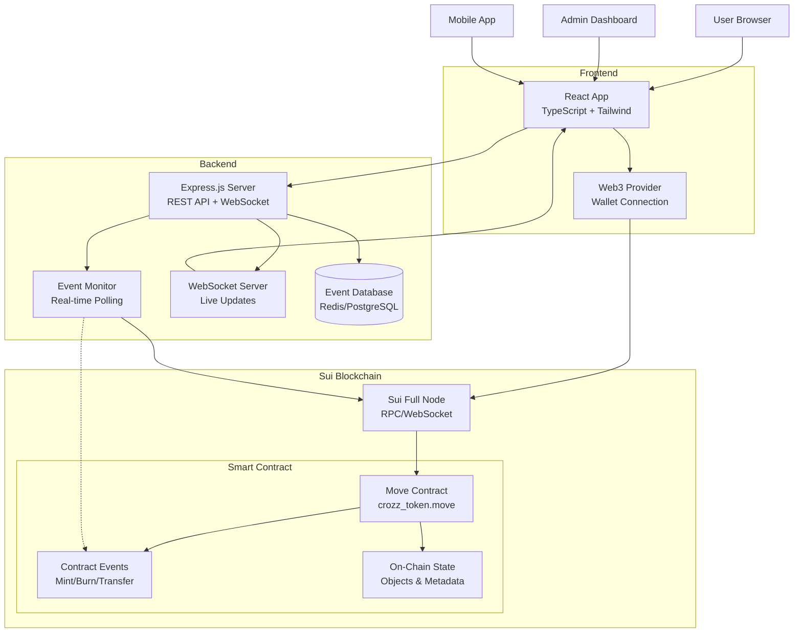
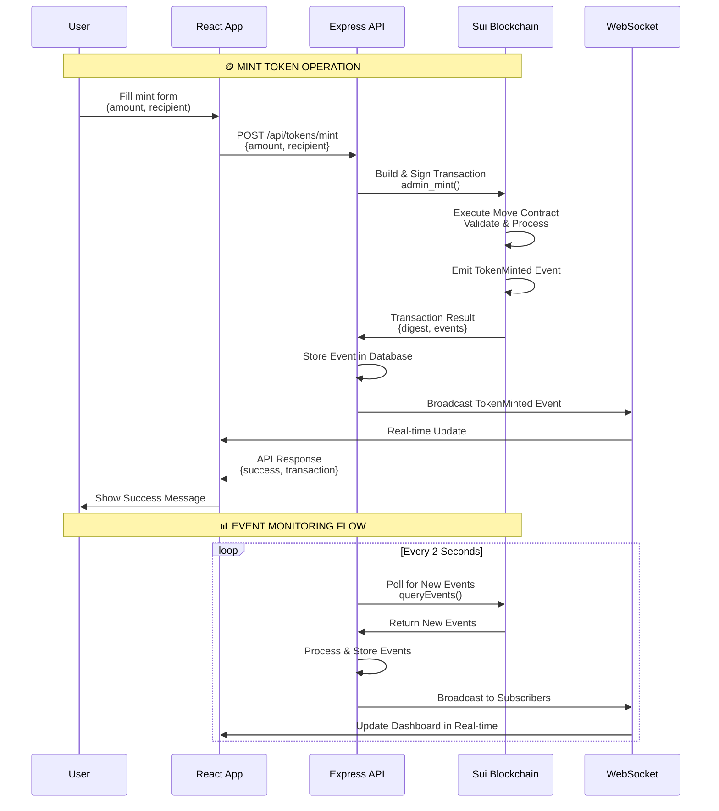
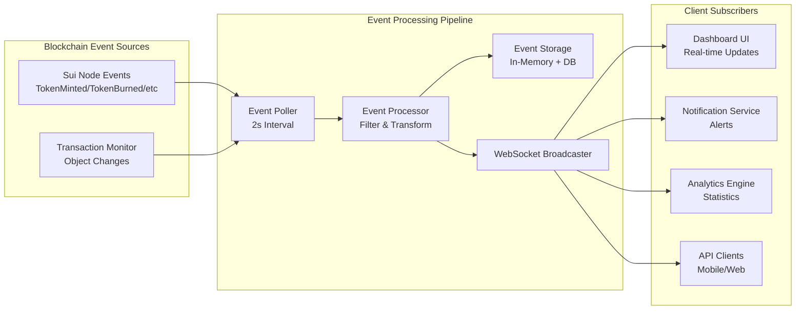
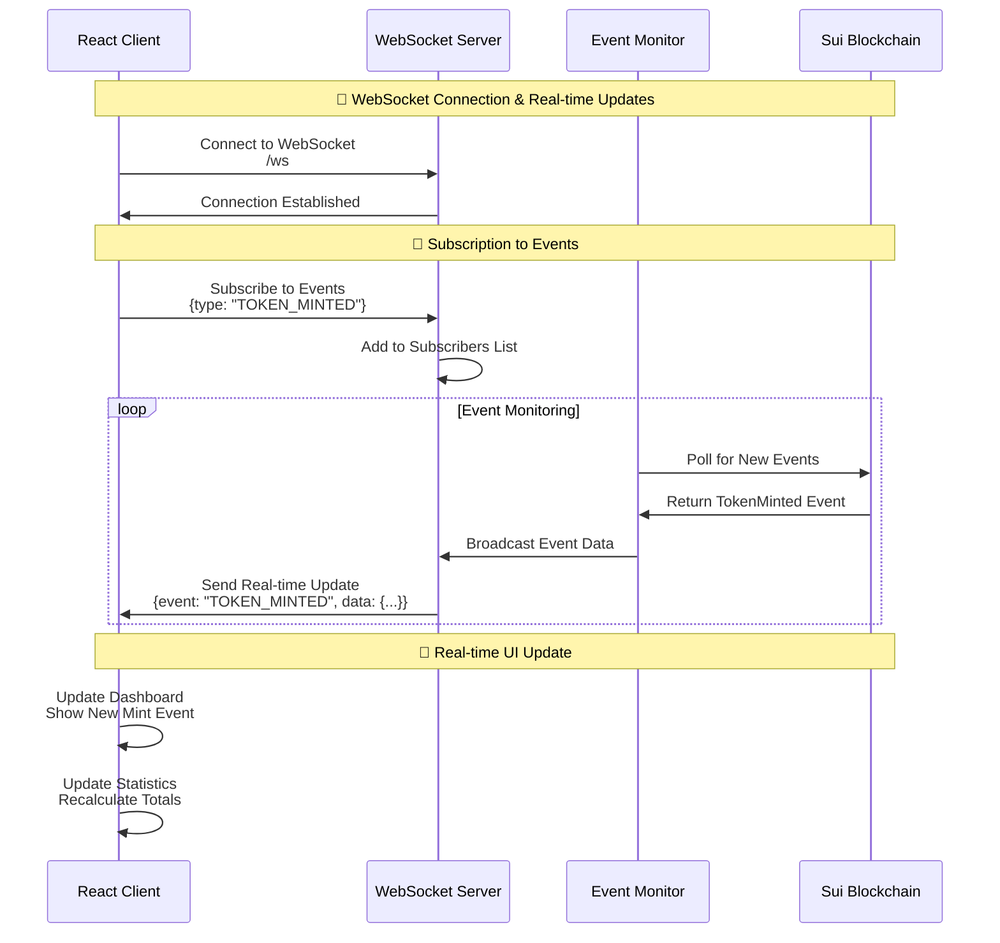
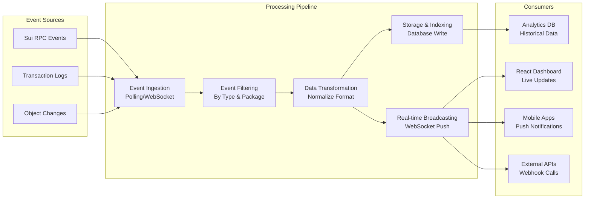
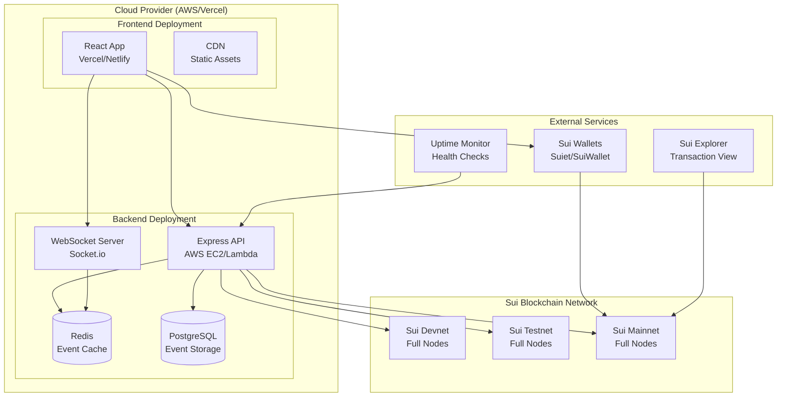

# crozz_token
crozz the new stage.     

https://crozzcoin.com/

🏗️ System Architecture Diagram



🔄 Data Flow Sequence Diagram



🏃‍♂️ CRUD Operations Flow

```mermaid
flowchart TD
    START[Start Operation] --> TYPE{Operation Type}
    
    TYPE -->|CREATE| CREATE[Mint Tokens]
    TYPE -->|READ| READ[Query Data]
    TYPE -->|UPDATE| UPDATE[Update Metadata]
    TYPE -->|DELETE| DELETE[Burn Tokens]
    
    %% CREATE FLOW
    CREATE --> C1[Validate Parameters<br/>amount > 0]
    C1 --> C2[Build Transaction<br/>admin_mint()]
    C2 --> C3[Sign with Admin Key]
    C3 --> C4[Execute on Sui]
    C4 --> C5[Emit TokenMinted Event]
    C5 --> SUCCESS[Success Response]
    
    %% READ FLOW
    READ --> R1{Query Type}
    R1 -->|Events| R2[queryEvents<br/>MoveEventType]
    R1 -->|Balance| R3[getCoins<br/>owner + coinType]
    R1 -->|Object| R4[getObject<br/>showContent: true]
    R2 --> R5[Process & Format]
    R3 --> R5
    R4 --> R5
    R5 --> SUCCESS
    
    %% UPDATE FLOW
    UPDATE --> U1[Validate Admin<br/>is_admin()]
    U1 --> U2[Build Transaction<br/>update_metadata()]
    U2 --> U3[Sign & Execute]
    U3 --> U4[Emit MetadataUpdated Event]
    U4 --> SUCCESS
    
    %% DELETE FLOW
    DELETE --> D1[Validate Coin Exists<br/>getObject()]
    D1 --> D2[Build Transaction<br/>admin_burn()]
    D2 --> D3[Sign & Execute]
    D3 --> D4[Emit TokenBurned Event]
    D4 --> SUCCESS
    
    SUCCESS --> END[Return to User]
```

📡 Real-time Event Monitoring Architecture



🏗️ Complete File Structure Diagram

```
croz-ecosystem/
├── 📱 Frontend (React)
│   ├── src/
│   │   ├── components/
│   │   │   ├── Dashboard/
│   │   │   │   ├── TokenOverview.tsx
│   │   │   │   ├── TokenActions.tsx
│   │   │   │   └── EventsFeed.tsx
│   │   │   ├── UI/
│   │   │   │   ├── Button.tsx
│   │   │   │   └── Card.tsx
│   │   │   └── Layout/
│   │   │       └── Header.tsx
│   │   ├── hooks/
│   │   │   ├── useTokenData.ts
│   │   │   └── useWebSocket.ts
│   │   ├── utils/
│   │   │   └── sui.ts
│   │   └── App.tsx
│   └── package.json
├── 🚀 Backend (Express)
│   ├── src/
│   │   ├── services/
│   │   │   ├── EventMonitor.js
│   │   │   ├── TransactionService.js
│   │   │   └── WebSocketService.js
│   │   ├── routes/
│   │   │   ├── tokens.js
│   │   │   ├── events.js
│   │   │   └── admin.js
│   │   ├── middleware/
│   │   │   └── auth.js
│   │   └── server.js
│   └── package.json
├── ⛓️ Smart Contract (Move)
│   ├── sources/
│   │   └── crozz_token.move
│   └── Move.toml
└── 🔧 Configuration
    ├── .env
    └── docker-compose.yml
```

🔄 WebSocket Real-time Flow



🛡️ Security & Authentication Flow

```mermaid
flowchart TD
    USER[User Request] --> WALLET{Wallet Connected?}
    
    WALLET -->|No| CONNECT[Connect Wallet<br/>Sui Wallet]
    WALLET -->|Yes| VERIFY[Verify Signature]
    
    CONNECT --> VERIFY
    
    VERIFY --> AUTH{Admin Function?}
    
    AUTH -->|Yes| CHECK_ADMIN[Check Admin Capability<br/>is_admin()]
    AUTH -->|No| PROCEED[Proceed with Request]
    
    CHECK_ADMIN -->|Authorized| PROCEED
    CHECK_ADMIN -->|Unauthorized| ERROR[Error: Not Admin]
    
    PROCEED --> BUILD[Build Transaction]
    BUILD --> SIGN[Sign with Appropriate Key]
    SIGN --> EXECUTE[Execute on Blockchain]
    EXECUTE --> RESULT[Return Result]
    
    ERROR --> END[Show Error Message]
    RESULT --> END
```

📊 Event Processing Pipeline



🎯 Complete Deployment Architecture



Key Components Summary:

1. 🏗️ Move Smart Contract: On-chain logic with event emission
2. 🚀 Express Backend: REST API + WebSocket for real-time updates
3. 📱 React Frontend: User interface with live dashboard
4. 🔍 Event Monitor: Continuous blockchain polling
5. 📡 WebSocket Server: Real-time client updates
6. 💾 Database: Event storage and caching
7. 🔗 Sui RPC: Blockchain communication layer

This architecture provides:

· ✅ Real-time updates via WebSocket
· ✅ Complete CRUD operations via REST API
· ✅ Event-driven architecture for scalability
· ✅ Secure admin controls with wallet auth
· ✅ Multi-environment support (devnet/testnet/mainnet)
· ✅ Comprehensive monitoring and analytics